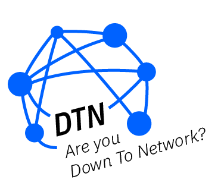

<h1 align="center">
  <br>
  <a href="https://github.com/nicholasadamou/DownToNetwork"></a>
  <br>
  Down to Network's Front-End
  <br>
</h1>

<h4 align="center">The directory contains everything required to interact with the frontend of <em>DownToNetwork</em>.</h4>

<p align="center">
	
  <a href="https://github.com/nicholasadamou/DownToNetwork/blob/master/LICENSE.txt">
      
  </a>
  <a href="https://travis-ci.org/nicholasadamou/DownToNetwork">
      
  </a>
  <a href="https://saythanks.io/to/NicholasAdamou">
      
  </a>
</p>

---

## 🤔 What is '_Down To Network_'?

This project was created for the Summer IBM HackCIO event, where fellow IBM interns in groups of 4 had 24 hours to design and construct an app that would improve IBM in one of the following categories:

1. Inclusion
2. Community Building
3. Environmental Friendly
4. Onboarding Process

🏆 **_DownToNetwork_** **won** under the category **_Community Building_** and voted **_Most likely to be used at IBM_**.

DownToNetwork is a dynamic web / mobile app optimized to connect new fellow IBMers to experienced IBMers through the power of matching.

## 🧐 Problem Statement

Many of our co-workers at IBM have mentioned how difficult it is to meet talented individuals outside of their respective teams.

## 💡 Idea / Solution

We designed the app to have a "tinder-like" feel where you sign up and create an account and tell the application about yourself and your intentions. The application uses an algorithm designed to connect users based on their role at IBM (Intern, manager, etc) and the types of people that they would like to meet. Once a user is signed up, they are presented with the home page where they are able to swipe right or left on each individual that the app deems you'd find interesting enough to network with. Once you 'match' with an individual, the application rightfully says, for example, 'Ginni is Down To Network!' and presents a match screen where you can email the individual.

## ⛓️ Dependencies / Limitations

Since the app does not integrate with IBM w3, the application requires already on-boarded IBMer's to sign up though the app itself.

## 🚀 Future Scope

The application can continue to evolve in the following ways:

    - Add a calendar feature that allows user's to block time on a calendar to meet those who they have matched with through the app.
    - A messaging feature that allows matched users to chat with others they matched with.

## 📚 The Tech. Stack

This project uses the following technologies:

**The Front-End**:

-   [**React.js**](https://reactjs.org/) - For building the interface along with:
    -   [**React Router**](https://reacttraining.com/react-router/) - for declarative routing for React.
    -   [**React Context API**](https://reactjs.org/docs/context.html) - Context provides a way to pass data through the component tree without having to pass props down manually at every level.
    -   [**Styled-Components**](https://www.styled-components.com/) - for styling.

## 🏁 Getting Started

These instructions will get you a copy of the project up and running on your local machine for development and testing purposes.

### Prerequisites

-   [Node.js](https://nodejs.org/en/)
-   [yarn](https://yarnpkg.com/en/)

### Installing

First, clone the repository, then run

```bash
yarn install # alteratively, 'npm' can be used
```

followed by

```bash
yarn start
```

### Modify `.env.example`

⚠️ Don't forget to modify the contents of `.env`! Take `.env.example` and fill out its contents and rename it to `.env`.

## 🎉 Acknowledgments

    - Thank you to our mentor's.
    - A big thank you to IBM and the organizers of HackCIO!

## License

DownToNetwork is © 2019, Nicholas Adamou, Edward Lovely, Stephen Alt, Diana Bank, & Julia Lauer.

It is free software, and may be redistributed under the terms specified in the [LICENSE] file.

[license]: LICENSE
